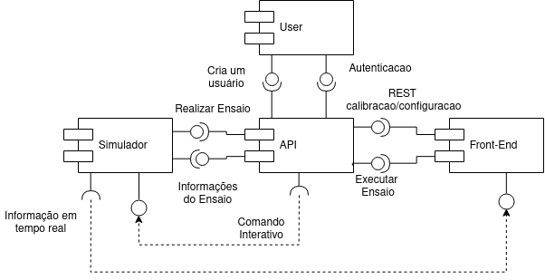

## Documento de Arquitetura

Este documento tem como objetivo relatar de forma técnica o software utilizando várias visões da arquitetura do mesmo. Este documento é conhecido na literatura como *4+1 architecture blueprints*.

___
### Histórias de Usuário

Os aspectos funcionais estão levantados neste [link](../backlog.md)

___
### Visão Lógica

#### Ensaio de Frenagem

O UnBrake é um sistema que realiza suporte a testes de frenagem. O sistema se baseia em um sistema produzido e testado por acadêmicos da [Universidade de Brasília](http://www.unb.br/).

Para realizar os ensaios o sistema trabalha com arquivos de configuração do ensaio e também da calibração dos sensores. Por sua vez os ensaios são compostos por *Snubs* (Um sequência de atividades feitas pelo simulador) e a repetição de cada *Snub* (realizando o resfriamento a cada intervalo) é o que é chamado de ensaio.

#### Uma breve visão de nossa arquitetura

Nosso projeto está sendo modelado com uma arquitetura de microserviços que tem 4 serviços base:

* Simulador: Um servidor escrito em [golang](https://golang.org/) que é responsável tanto por receber os arquivos de configuração quanto de fornecer dados em *stream* para o requisitante.

* API: A API contém as regras de negócio do nosso sistema, ela recebe os arquivos de configuração e relaciona ele com os ensaios.

* Usuários: Serviço que guarda realiza a autenticação dos usuários.

* Front-End: A interface com o usuário do nosso sistema que usa todos os serviços anteriores.

#### Front End

O front end é composto por uma tela de login e uma de signin, assim como uma tela principal a qual possui um menu lateral para a navegação entre as sub-telas as quais são restringidas dentro de um fragmento e, anexado ao mesmo, será aberto as outras páginas para a configuração e templates para a calibração e configuração, assim como os gráficos de como o freio se comporta

##### Depedencias:

* material-ui/core: 3.9.2
* material-ui/icons: 3.0.2
* classnames: 2.2.6
* prop-types: 15.7.2
* react: 16.8.5
* react-redux: 6.0.1
* react-router-dom: 5.0.0
* react-scripts: 2.1.0
* react-test-renderer: 16.8.6
* recharts: 1.5.0
* redux: 4.0.1
* redux-form: 8.1.0
* redux-form-material-ui: 5.0.0-beta.3
* recharts: 1.5.0
* universal-cookie: 3.1.0

#### API

A nossa API possui primordialmente três aplicações, com models e schemas, sendo elas, Users, Calibration e Configuration, as duas sendo conectadas com o graphql, o qual possui o propósito de se ligar com o front end, as classes se comunicam entre si por meio da classe Test.

##### Depedencias:

* Django: 2.2
* autopep: 1.4.3
* coverage: 4.5.3
* django-cors-headers: 2.5.2
* django-graphql-jwt: 0.2.1
* flake8: 3.7.7
* graphene: 2.1.7
* graphene_django: 2.2.0
* pylint-django: 2.0.6
* pytest-django: 3.4.8
* pytest: 4.4.0

#### Simulador

O serviço que tem contato com o simulador tem as seguintes funcionalidades:

* Recebe informações sobre o ensaio
* Realiza o controle de acesso ao simulador
* Realiza todas as validações necessárias no arquivo de configuração.
* Roda o ensaio recebendo as configurações ou os comandos interativos.
* Fornece os resultados realizando uma *stream* de dados para um determinado endereço.

##### Autenticação de usuário

O serviço de autenticação do usuário é responsável por receber informações de autenticação e retornar um *token* de acesso para consumo dos outros serviços.

____
### Visão de Processo

O visão de processo do software permeia vários tópicos que serão listados a seguir e após isso explicaremos mais detalhadamente cada um. Essa visão é complementar aos **Design Docs**.

* **Serviço de autenticação:** Controle de acesso
* **Acordo de transmissão simulador/front:** Garante que o requisito de velocidade da atualização do gráfico em tempo real seja cumprido
* **Catalogo de Serviço (Consul):** garante a escalabilidade horizontal do sistema
* **API integrada com GraphQL:** O GraphQL busca facilitar a lógica de criação das views

#### Serviço de autenticação do usuário.

O serviço de autenticação cuida para que somente pessoas cadastradas no sistema consigam consumir qualquer serviço do próprio (simulador, frontend, api).

#### Acordo de transmissão entre o Simulador e o FrontEnd

O acordo de transmissão acontece com o software do FrontEnd disponibilizando uma porta e um endereço de ip para a stream de dados em tempo real ser enviada. Após essa definição as informações são mandadas via API e por fim configuradas no simulador. O simulador inicia a transmissão dos dados utilizando o protocolo [MQTT](https://mqtt.org/).

#### Catalogo de serviço

O catalogo de serviço serve para garantir a fácil escalabilidade do sistema, além de confirir a ele a capacidade de realiza o deploy dinamicamente em vários provedores diferentes. O objetivo é criar uma interface que deve ser consultada toda vez que um serviço precisar se comunicar com outro, desta forma podemos ter vários  serviços no nosso catalogo e o mesmo direciona a requisição para qualquer nó registrado. Além disso o catalogo de serviço abstrai a rede em que os serviços estão implantados conferindo a capacidade de deploy dinâmico.

#### API integrada ao GraphQL

O GraphQL é um framework que diminuir as barreias entre view e model. Com essa ferramenta temos a capacidade de facilmente criar uma *REST API* complexa com vários pontos. A vantagem é que deixa a cargo das views da API lidarem somente com regras de negócio realmente complexas ou que irão interagir com outros serviços.

___
### Visão de desenvolvimento

As interações entre os serviços estão representadas no diagrama de componente abaixo.

Todas e qualquer modificação da arquitetura deverá ser listada nos documentos de *Design Docs*. O diagrama acima representa a arquitetura final do projeto em termos de serviço e interação entre eles.

___

### Visão física

Para desenvolvimento utilizaremos os containers do [docker](https://www.docker.com/). Para o funcionamento completo do nosso sistema os seguintes containers precisam ser iniciados:
* Consul: Ferramenta de catálogo de serviços
* Postgres: Banco de dados
* Simulador: Servidor que contém o software que comunica com o *hardware* de simulação.
* FrontEnd: Inicia a interface de usuário
* Broker: Para realizar a comunicação do simulador com o Front via MQTT
* Autenticador: Serviço que realiza a autenticação dos usuários para o uso dos outros serviços.

O deploy da aplicação está realizado em [UnBrake](http://unbrake-hom.ml/).
