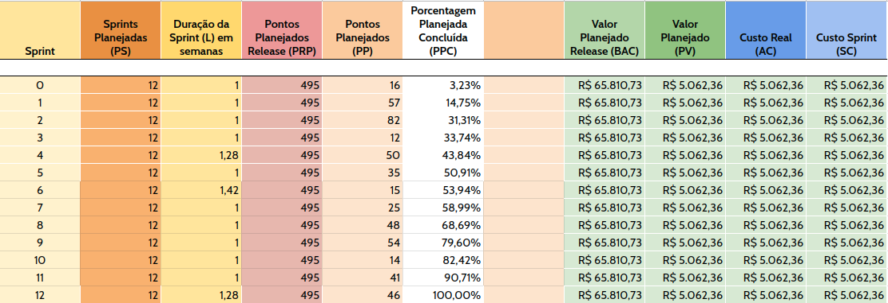

## Histórico de Revisão

| Data | Responsável | Versão | Mudança realizada |
|:----:| ----------- |:------:| ----------------- |
| **06/04/19** | [@ViniciusBernardo](https://github.com/ViniciusBernardo) | 1 | Avaliação inicial do custo do produto |

## 1. Introdução

Este documento abrange uma visão detalhada do custo estimado para o desenvolvimento do produto UnBrake. O custo total está dividido em 3 parte:

* Custo dos desenvolvedores e gerentes;
* Custo de equipamentos e infraestrutura;
* Margem de lucro e risco do projeto (dependem dos dois citados acima)

## 2. Estimativa do custo de pessoal

Levando em consideração a média salarial para cada papel específico da equipe (desenvolvedor, arquiteto, devops, scrum master e product owner), a estimativa do custo de pessoal do desenvolvimento do produto é dado pela seguinte equação:

> Equação custo de pessoal $cp$
>
> $$cp = (nDevelopers * hourDeveloper + nManagers * hourManager) * (nSprints * hoursPerWeek)$$ (1)

onde:

* $cp$: custo total de pessoal;
* $nDevelopers$: constante de valor 5 representando o número de desenvolvedores na equipe;
* $nManagers$: constante de valor 4 representando o número de gerentes na equipe;
* $hourDeveloper$: variável que representa o valor da hora de um desenvolvedor. Considerado como sendo igual a 35;
* $hourManager$: variável que representa o valor da hora de um desenvolvedor. Considerado como sendo igual a 48;
* $nSprints$: constante de valor 13 considerando a sprint 0;
* $hoursPerWeek$: variável com o esforço médio em horas por semana requirido para cada membro da equipe. Considerado como sendo igual a 8.

Sendo assim, temos que $cp$ é igual a:

> $$cp = (5 * 35 + 4 * 48) * 13 * 8$$
> $$cp = 38.168,00$$

## 3. Estimativa de custo de equipamento e infraestrutura

### 3.1 Equipamento

Para o cáculo de equipamento, será considerado o valor de depreciação dos notebooks utilizados pelos integrantes da equipe. Serão necessárias as seguintes equações de descapitalização e conversão de juros para que o cálculo seja aplicado corretamente:

> Equação de descapitalização em um período de tempo
>
> $$valorFuturo = \frac{valorPresente}{(1+(\frac{taxaDepreciacaoMensal}{100})^{(\frac{nInicio}{nFim})})}$$ (2)

> Equação de conversão de taxa de juros
>
> $$1+taxaConhecida = (1+taxaAlvo)^{periodo}$$ (3)

O valor total de depreciação dos equipamentos é o somatório da diferença do valor de aquisição de cada notebook com o seu valor ao final do projeto para uma $taxaDepreciacaoAnual$ igual a 20%, $nInicio=1$ e $nFim=3$ (o projeto possui duração de 13 sprints de 1 semana). A seguinte equação torna isso mais claro:

> Equação para o cálculo total do custo de equipamento $ce$
>
> $$ce = \sum_{i=1}^9 valorPresente_{i} - valorFuturo_{i}$$ (4)

Aplicando a conversão da $taxaDepreciacaoAnual$ (3) obtemos a $taxaDepreciacaoMensal$:

> $$1 + 0.2 = (1 + taxaDepreciacaoMensal)^{12}$$
> $$(1 + 0.2)^{\frac{1}{12}} = 1 + taxaDepreciacaoMensal$$
> $$taxaDepreciacaoMensal = 0.0153$$

Aplicando a equação (2) para cada um dos notebooks dos 9 membros da equipe, considerando que todos possuem o $valorPresente = 3.000,00$ e em seguida utilizando os valores conhecidos na equação (4) chegaremos ao resultado de $ce$

> Valor final de $ce$
>
> $$valorFuturo = \frac{3000}{1+\frac{0.0153}{100}^{\frac{1}{3}}}$$
> $$valorFuturo = 2.847,69$$
>
> $$ce = 9*(3000 - 2847,69)$$
> $$ce = 1.370,79$$

### 3.2 Infraestrutura

O sistema ficará hospedado em um servidor Kubernetes em nuvem da DigitalOcean durante seus 3 meses de duração. De acordo com o [site oficial da DigitalOcean](https://www.digitalocean.com/pricing/), o valor mensal de um Kubernetes é de 30 dólares americanos. Considerando o valor médio do dólar americano como sendo R$ 3,85, temos que o custo de infraestrutura $ci$ do projeto é de:

> Custo de infraestrutura $ci$
>
> $$ci = 3 * 30 * 3,85$$
> $$ci = 346,50$$

## 4. Lucro, Risco e custo total

A porcentagem de lucro e risco serão aplicados sobre a somatória do custo de pessoal $cp$, custo de equipamento $ce$ e custo da infraestrutura $ci$ calculados nos tópicos anteriores.
A taxa de lucro aplicada sera de 20% ($lucro = 0.2$). Já a taxa de risco será de 45% devido aos seguintes fatores:

* O sistema precisa lidar com dados em real time;
* É necessário fazer comunicação serial com o sistema embarcado controlador do simulador de frenagem;
* Como o simulador de frenagem é um sistema mecânico, existe o requisito implícito que o software precisa ter uma alta qualidade e nível de testes.

Sendo assim, o custo total $ct$ to projeto fica:

> Custo total do projeto
>
> $$ct = (cp + ce + ci) * (1 + 0.2 + 0.45)$$
> $$ct = (38.168,00 + 1.370,79 + 346,50) * (1,65)$$
> $$ct = 65.810,73$$

## 5. EVM

Tabela com valor planejado por sprint

----

Tabela com valor agregado por sprint

----

Tabela com gráfico do EVM

