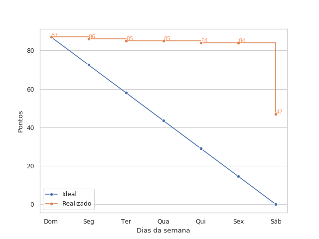

# Resultados da Sprint 2

## Informações básicas

|Pontuação|Valores|
|-----|-----|
|Planejada|87|
|Total entregue|40|
|Dívida técnica|47|

## Issues

|Nome da issue|Pontos|Situação|
|-----|-----|----|
|[Create form for configuration module](https://github.com/fga-eps-mds/2019.1-unbrake/issues/9)|3|Não fechada|
|[Criar Estrutura Analítica do Projeto (EAP)](https://github.com/fga-eps-mds/2019.1-unbrake/issues/29)|2|Fechada|
|[Criar autenticação de usuário](https://github.com/fga-eps-mds/2019.1-unbrake/issues/36)|13|Não fechada|
|[Criar view para receber configurações](https://github.com/fga-eps-mds/2019.1-unbrake/issues/38) |13|Não fechada|
|[Criar formulário para calibração de temperatura](https://github.com/fga-eps-mds/2019.1-unbrake/issues/39) |5|Não fechada|
|[Criar formulário para configurações do ensaio](https://github.com/fga-eps-mds/2019.1-unbrake/issues/40) |8|Fechada|
|[Criar plano para gerenciamento de riscos](https://github.com/fga-eps-mds/2019.1-unbrake/issues/41) |2|Fechada|
|[Criar template do documento de arquitetura](https://github.com/fga-eps-mds/2019.1-unbrake/issues/42) |8|Fechada|
|[Criar template para pull request](https://github.com/fga-eps-mds/2019.1-unbrake/issues/43) |1|Fechada|
|[Adicionar dependências para realizar testes unitários no React](https://github.com/fga-eps-mds/2019.1-unbrake/issues/45) |1|Fechada|
|[Realizar integração da autenticação no front-end](https://github.com/fga-eps-mds/2019.1-unbrake/issues/47) |8|Não fechada|
|[Decisão sobre protocolo de comunicação do gráfico](https://github.com/fga-eps-mds/2019.1-unbrake/issues/48) |3|Fechada|
|[Criar Plano de Custo](https://github.com/fga-eps-mds/2019.1-unbrake/issues/53) |2|Fechada|
|[Configuração inicial do ambiente do backend](https://github.com/fga-eps-mds/2019.1-unbrake/issues/55) |2|Fechada|
|[Ignorar diretório de snapshots criado pelo Jest](https://github.com/fga-eps-mds/2019.1-unbrake/issues/56) |1|Fechada|
|[Analisar viabilidade do uso do GraphQL](https://github.com/fga-eps-mds/2019.1-unbrake/issues/58) |3|Fechada|
|[Estabelecer forma de documentação das decisões de arquitetura](https://github.com/fga-eps-mds/2019.1-unbrake/issues/60) |2|Fechada|
|[Melhorar o tema da página do projeto](https://github.com/fga-eps-mds/2019.1-unbrake/issues/62) |5|Não Fechada|
|[Configurar ferramentas de checkagem do backend](https://github.com/fga-eps-mds/2019.1-unbrake/issues/64) |5|Fechada|

## Burndown

## Velocity

## Dailies
|Nome| Seg| Ter| Qua| Qui| Sex|
|-|----|----|----|----|----| 
|Gabriel|x|x|x|x|-|
|Felipe|x|x|x||-|
|Ícaro|x|x||x|-|
|João|x|x|x|x|-|
|Letícia|x|x|x|x|-|
|Lucas|x|x|x|x|-|
|Tiago|x|x|x|x|-|
|Victor||||x|-|
|Vinicius|x|x||x|-|

## Quadro de conhecimentos

 
 
 

## Comentários do Scrum Master

A Sprint 2 foi um ponto de virada no projeto. Nela, o back-end começou a ser desenvolvido e a ser integrado com alguns dos componentes do front-end já criados. Nessa sprint, as ferramentas de checagem começaram a ser usadas também, assim como a obrigatoriedade da realização de testes unitários passou a ser exigida. Soma-se a esses fatores a decisão de mudança, na metade da sprint, da ferramenta para configurar e prover a API REST no Django (de Django REST framework para GraphQL), justificada e comentada <a href="https://github.com/fga-eps-mds/2019.1-unbrake/issues/58">aqui</a>. Todos esses aspectos juntamente com a adição de algumas dificuldades extras nas issues (no back-end, grande parte era, mesmo com os treinamentos, uma novidade para MDS, e no front-end o uso mais efetivo do Redux) causou o atraso na entregua de 4 das 5 issues planejadas para a sprint, assim como a issue que havia ficado de dívida técnica da sprint anterior.

Vale destacar que um ponto que dificultou e atrasou muito o time de desenvolvimento foi a ferramenta de checagem de código criada na sprint anterior. Seu funcionamento é demonstrado <a href="https://github.com/fga-eps-mds/2019.1-unbrake/pull/32">aqui</a>. Basicamente, ela bloqueia commits e pushs (sendo possível evitar isso por meio de uma flag, o que foi dito pelos gerentes para ser usado com parcimônia) se as checagens de folha de estilo, typechecking e teste não estiverem passando. Com isso, ao fim da sprint, várias issues já estavam "prontas", no sentido de já estarem funcionais, mas ainda não haviam atingido o nível de qualidade exigido, o que impossibilitou a aceitação dos PR's.

Outra decisão importante foi utilizar um bot do Slack para realizar a daily meeting de sexta e para reporte de membros em caso de ausência em algum dos outros dias. A retirada da reunião na sexta ocorreu pela impossibilidade de 3 membros de MDS comparecerem presencialmente.

