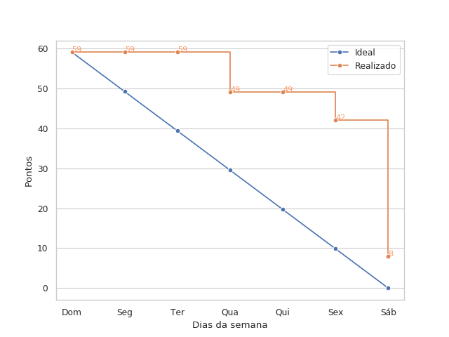

# Resultados da Sprint 3

## Informações básicas

|Pontuação|Valores|
|-----|-----|
|Planejada|59|
|Total entregue|51|
|Dívida técnica|8|

## Issues

|Nome da issue|Pontos|Situação|
|-----|-----|----|
|[Create form for configuration module](https://github.com/fga-eps-mds/2019.1-unbrake/issues/9)|3|Não fechada|
|[Criar autenticação de usuário](https://github.com/fga-eps-mds/2019.1-unbrake/issues/36)|13|Fechada|
|[Criar view para receber configurações](https://github.com/fga-eps-mds/2019.1-unbrake/issues/38) |13|Fechada|
|[Criar formulário para calibração de temperatura](https://github.com/fga-eps-mds/2018.1-unbrake/issues/39) |5|Fechada|
|[Realizar integração da autenticação no front-end](https://github.com/fga-eps-mds/2019.1-unbrake/issues/47) |8|Fechada|
|[Melhorar o tema da página do projeto](https://github.com/fga-eps-mds/2019.1-unbrake/issues/62) |5|Fechada|
|[Fazer o jest falhar em caso de warning](https://github.com/fga-eps-mds/2019.1-unbrake/issues/68)|1|Fechada|
|[Atualizar README com comandos de execução e checagem](https://github.com/fga-eps-mds/2019.1-unbrake/issues/70)|1|Fechada|
|[Criar comandos do manage.py semelhantes aos criados no npm](https://github.com/fga-eps-mds/2019.1-unbrake/issues/72)|2|Fechada|
|[Criar diagrama de classes do Django](https://github.com/fga-eps-mds/2019.1-unbrake/issues/74)|3|Fechada|
|[Entender o funcionamento da linguagem Go](https://github.com/fga-eps-mds/2019.1-unbrake/issues/78)|5|Não fechada|

## Burndown

## Velocity

## Dailies
|Nome| Seg| Ter| Qua| Qui| Sex|
|-|----|----|----|----|----| 
|Gabriel||x|x|x|-|
|Felipe|x|x|||-|
|Ícaro|x|x||x|-|
|João|x|x|x|x|-|
|Letícia|x|x|x|x|-|
|Lucas|x|x|x|x|-|
|Tiago|x||x|x|-|
|Victor|||x|x|-|
|Vinicius||x||x|-|

## Quadro de conhecimentos

 
 
 

## Comentários do Scrum Master
