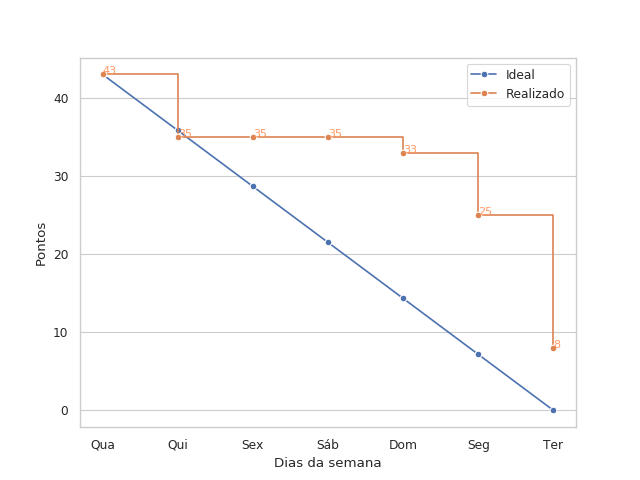
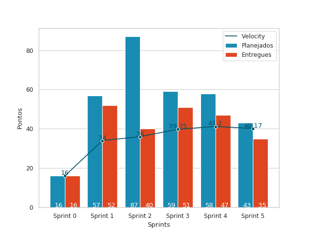
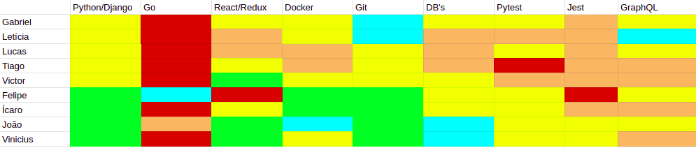

# Resultados da Sprint 5

## Informações básicas

|Pontuação|Valores|
|-----|-----|
|Planejada|43|
|Total entregue|35|
|Dívida técnica|8|

## Issues

|Nome da issue|Pontos|Situação|
|-----|-----|------|
|[Criar Documento de visão](https://github.com/fga-eps-mds/2019.1-unbrake/issues/91)|3|Fechada|
|[Criar comunicação do servidor Go com um canal de comunicação serial](https://github.com/fga-eps-mds/2019.1-unbrake/issues/97)|8|Não fechada|
|[Preparar ambiente de produção da api](https://github.com/fga-eps-mds/2019.1-unbrake/issues/114)|3|Fechada|
|[Preparar ambiente de produção do frontend](https://github.com/fga-eps-mds/2019.1-unbrake/issues/116)|2|Fechada|
|[Ajustar o layout dos formulários](https://github.com/fga-eps-mds/2019.1-unbrake/issues/117)|3|Fechada|
|[Reservar domínio e integrar no projeto](https://github.com/fga-eps-mds/2019.1-unbrake/issues/119)|2|Fechada|
|[Telas de login e cadastro não estão acessíveis a um usuário](https://github.com/fga-eps-mds/2019.1-unbrake/issues/120)|1|Fechada|
|[Todas as requisições do frontend estão sendo feitas no localhost](https://github.com/fga-eps-mds/2019.1-unbrake/issues/123)|1|Fechada|
|[Criar documento de protótipo](https://github.com/fga-eps-mds/2019.1-unbrake/issues/125)|2|Fechada|
|[Adequar documento de arquitetura](https://github.com/fga-eps-mds/2019.1-unbrake/issues/128)|3|Fechada|
|[Criar roadmap de Scrum Master](https://github.com/fga-eps-mds/2019.1-unbrake/issues/129)|1|Fechada|
|[Redirecionamento do gh-pages não funciona](https://github.com/fga-eps-mds/2019.1-unbrake/issues/131)|1|Fechada|
|[Criar Roadmap do engenheiro de produto](https://github.com/fga-eps-mds/2019.1-unbrake/issues/132)|1|Fechada|
|[Integrar build de homologação ao CI](https://github.com/fga-eps-mds/2019.1-unbrake/issues/133)|2|Fechada|
|[Realizar deploy contínuo do ambiente de homologação](https://github.com/fga-eps-mds/2019.1-unbrake/issues/135)|2|Fechada|
|[Consertar fluxo das rotas](https://github.com/fga-eps-mds/2019.1-unbrake/issues/136)|3|Fechada|
|[Melhorar a estrutura do código do frontend](https://github.com/fga-eps-mds/2019.1-unbrake/issues/138)|2|Fechada|
|[Ajustar o tema do frontend](https://github.com/fga-eps-mds/2019.1-unbrake/issues/139)|1|Fechada|
|[Realizar deploy contínuo do ambiente de produção](https://github.com/fga-eps-mds/2019.1-unbrake/issues/142)|1|Fechada|
|[Criar documento de Identidade Visual](https://github.com/fga-eps-mds/2019.1-unbrake/issues/144)|1|Fechada|

## Burndown

## Velocity

## Dailies
|Nome| Qua| Qui| Sex|Seg|Ter
|-|----|----|----|----|----|
|Gabriel|x|x|-|x|-|
|Felipe|||-|x|-|
|Ícaro|x||-|x|-|
|João|x|x|-|x|-|
|Letícia|||-|x|-|
|Lucas|x|x|-|x|-|
|Tiago|x|x|-|x|-|
|Victor|x|x|-||-|
|Vinicius||x|-||-|

## Retrospectiva

### Pontos Ruins

* Biblioteca do componente do gráfico em tempo real eve que ser trocado;
* Descuido da equipe com o produto;
* Confusão a respeito do papel do prof. Evandro no projeto;
* Maneira como os documentos de MDS foram distribuídos entre os membros;
* Comunicação;
* Issues dos documentos de MDS não foram criadas pelo Scrum Master, gerando confusão;
* Ausência do [@ViniciusBernardo](https://github.com/ViniciusBernardo) nas reuniões, decisões, etc.

### Pontos bons

* Proatividade dos desenvolvedores;
* Ajuda do [@VictorLeviPeixoto](https://github.com/VictorLeviPeixoto) no documento de arquitetura;
* Alinhamento da visão da equipe acerca do projeto;
* Documentos de MDS foram feitos.

### Melhorias

* Comunicação em geral;
* Gerentes tem que analisar decisões técnicas com mais cautela.

## Quadro de conhecimentos

 
 
 

## Comentários do Scrum Master

Essa sprint foi dedicada a refatoração e correção de bugs mais críríticos do sistema, assim como escrita dos documentos de MDS. Também foi dado um foco grande no deploy e integração contínua como um todo e na elaboração do MVP, que demandou bastante tempo por parte do Arquiteto, <a href="https://github.com/Bumbleblo" >Felipe</a>, na tentativa de estabelecer a comunicação serial usando Golang. Por questões técnicas enfrentadas e tentativas frustadas de realizar essas comunicação com outras linguagens inclusive (Python, C e C++), optou-se por realizar apenas um "mock" desse servidor utilizando Flask e socket. 

