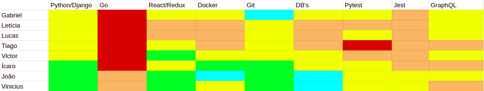

# Resultados da Sprint 6

## Informações básicas

|Pontuação|Valores|
|-----|-----|
|Planejada|23|
|Total entregue|21|
|Dívida técnica|2|

## Issues

|Nome da issue|Pontos|Situação|
|-----|-----|------|
|[Criar comunicação do servidor Go com um canal de comunicação serial](https://github.com/fga-eps-mds/2019.1-unbrake/issues/97)|8|Fechada|
|[Tela de login e cadastro não dão feedback ao usuário](https://github.com/fga-eps-mds/2019.1-unbrake/issues/146)|2|Não fechada|
|[Conteúdo do token não está sendo checado](https://github.com/fga-eps-mds/2019.1-unbrake/issues/147)|3|Fechada|
|[Consertar issues apontadas pelo Code Climate no back-end](https://github.com/fga-eps-mds/2019.1-unbrake/issues/149)|3|Fechada|
|[Consertar issues apontadas pelo Code Climate no front-end](https://github.com/fga-eps-mds/2019.1-unbrake/issues/150)|5|Fechada|
|[Habilitar HTTPS no ambiente de produção](https://github.com/fga-eps-mds/2019.1-unbrake/issues/151)|2|Fechada|

## Burndown

## Velocity

## Dailies

Em comum acordo, o grupo decidiu que, tendo em vista a impossibilidade de em alguns dias
boa parte dos membros não poder compararecer às dailies presenciais, o reporte nesses casos 
iria ser feito por meio do Daily Bot no Slack. Sendo assim, a necessidade de manter o registro
de presença se foi extinta.

## Retrospectiva

### Pontos Ruins

* Perdemos um membro (Felipe);
* Muito estresse;
* Perdemos a placa comprada pelo Felipe;
* EPS não trabalhou;
* Poucos membros na review.

### Pontos bons

* Rapidez em resolver issues;
* Pareamentos;
* MDS mais unido;
* Comunicação serial funcionou no Go;
* MDS com menos dificuldade;
* Felipe consegui comprar o arduino;
* Conversa com a prof. Carla sobre como resolver o problema de MDS entregar poucas issues.

### Melhorias

* Comprar a placa;
* EPS retomar o trabalho.

## Quadro de conhecimentos

 
 
 

## Comentários do Scrum Master

Nessa sprint, por conta de conflitos internos e discordância em relação a questôes técnicas e de gerenciamento,
o <a href="https://github.com/Bumbleblo" >Felipe</a> resolveu realizar o trancamento da matéria de EPS e não
participar mais do grupo. Nesse contexto, decidimos por manter os pápeis da maneira que foram antes da primeira
release até a release 2 e desse momento em frente focar no desenvolvimento do software em si e no auxílio a MDS 
na questão da absorção de conhecimentos. Além disso, se apresentou como urgente a tarefa de adquirir o Arduino
para os testes com o Go e a comunicação serial se iniciarem na prática.

