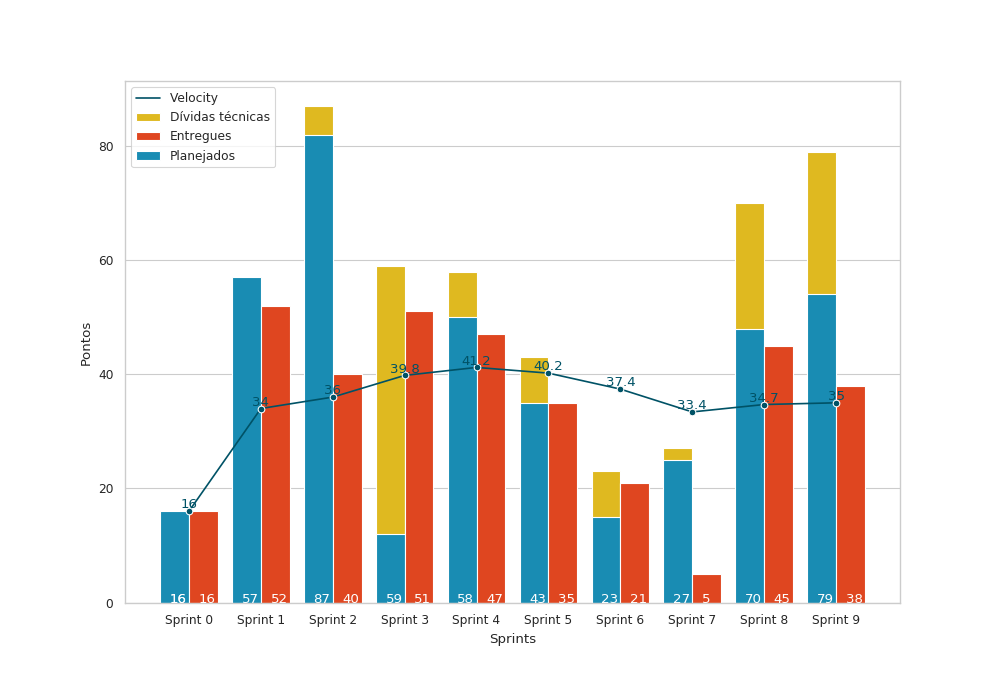

# Resultados da Sprint 9

## Informações básicas

|Pontuação|Valores|
|-----|-----|
|Planejada|79|
|Total entregue|38|
|Dívida técnica|41|

## Issues

|Nome da issue|Pontos|Situação|
|-----|-----|------|
|[Criar página de Ensaio](https://github.com/fga-eps-mds/2019.1-unbrake/issues/193)|13|Fechada|
|[O usuário não é redirecionado pra página de Login caso não esteja logado](https://github.com/fga-eps-mds/2019.1-unbrake/issues/194)|1|Fechada|
|[Acesso a página Sign up para todos os usuários](https://github.com/fga-eps-mds/2019.1-unbrake/issues/195)|1|Fechada|
|[Sempre é possível acessar a página de Login](https://github.com/fga-eps-mds/2019.1-unbrake/issues/196)|1|Fechada|
|[Refatorar o módulo calibração do frontend](https://github.com/fga-eps-mds/2019.1-unbrake/issues/199)|3|Não fechada|
|[Criar página de relações de calibração](https://github.com/fga-eps-mds/2019.1-unbrake/issues/203)|3|Não fechada|
|[Refatorar o módulo calibração do frontend](https://github.com/fga-eps-mds/2019.1-unbrake/issues/199)|3|Não fechada|
|[Criar página de relações de calibração](https://github.com/fga-eps-mds/2019.1-unbrake/issues/203)|8|Não fechada|
|[Refazer formulário de Comando](https://github.com/fga-eps-mds/2019.1-unbrake/issues/205)|5|Fechada|
|[Criar mecanismo para comandos seriais](https://github.com/fga-eps-mds/2019.1-unbrake/issues/208)|8|Não fechada|
|[Redefinir senha do usuário](https://github.com/fga-eps-mds/2019.1-unbrake/issues/209)|8|Não fechada|
|[Criar formulário de calibração de velocidade](https://github.com/fga-eps-mds/2019.1-unbrake/issues/177)|8|Fechada|
|[Usuário redirecionado para a tela de login ao atualizar a pagina](https://github.com/fga-eps-mds/2019.1-unbrake/issues/162)|1|Fechada|
|[Mover o upload de arquivo de calibração para página de calibração](https://github.com/fga-eps-mds/2019.1-unbrake/issues/164)|5|Não fechada|
|[Criar coleta inicial](https://github.com/fga-eps-mds/2019.1-unbrake/issues/192)|8|Fechada|
|[Criar página de configurações gerais da calibração](https://github.com/fga-eps-mds/2019.1-unbrake/issues/180)|3|Não fechada|

## Burndown

## Velocity

## Dailies

Em comum acordo, o grupo decidiu que por conta de haver muitos membros faltantes 
nas dailies presenciais, o reporte nesses casos iria ser feito por meio do Daily Bot 
no Slack e sendo assim, a necessidade de manter a lita de presença se tornou
desnecessária.

## Retrospectiva

### Pontos Ruins

* EPS não parar de tabalhar para almoçar;
* Não fizemos hora da dica do Lucas até hoje;
* MDS não está conversando entre si;
* Fechando PR's na reunião de review;
* EPS não foi na reunião do Evandro, com exceção do Ícaro;
* Nosso slack não tem mais taco;
* Codeclimate/testes abaixaram;
* Falta de mão de obra;
* Trabalho de criptografia tmou muito tempo.

### Pontos bons

* Tiago trabalhando muito!!; 
* Lucas está se tornando back-end developer raiz, aprendendo Go e usando o Vim;
* Vinicius programou;
* Binário do Go foi feito;
* Go rodando com a interface gráfica;
* Reunião com o Evandro aconteceu;
* Ícaro é muito paciente no pareamento.

### Melhorias

* Vinicius programar mais;
* Sair a comunicação do frontend com o Go usando MQTT.

## Quadro de conhecimentos

 
 
 

## Comentários do Scrum Master

Nessa sprint, o foco foi resolver uma grande quantidade de bugs e realizar algumas
melhorias enquanto a parte local era desenvolvida, além de terminar alguns formulários
restantes da parte de calibração. Em paralelo a isso, a página do ensaio
foi feita e a coleta inicial dos dados vindos da placa foi finalizada. É importante
ressaltar que, apesar da diminuição dos pontos entreges em relação a sprint passada,
MDS atingiu um grau de maturidade muito bom e uma melhor visão em relação ao projeto, tomando iniciativa
na criação e finalização das issues, apesar das outras matérias e problemas pessoais.

